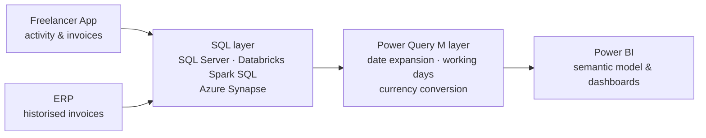

# 🔍 Freelancer Activity & Invoice Audit Framework

End-to-end data pipeline ( SQL, Azure Synapse, Power Query) to audit and reconcile freelancer activity data against ERP invoices, feeding a Power BI reporting layer. Includes a reproducible synthetic dataset so the pipeline logic can be explored without any real data.

## 🔒 Confidentiality & Data Privacy Notice
All code in this repository has been heavily anonymized to comply with Non-Disclosure Agreements (NDA) and corporate security policies.
- **Table and column names:** altered to generic industry standards.
- **Business logic:** geopolitical entities, internal IDs and vendor codes have been masked or generalized.
- **Data:** no real records are included. All data in `synthetic_data/` is entirely fictitious.

The underlying SQL complexity, feature engineering logic and data architecture patterns remain intact to demonstrate the technical approach.

## 🎯 Business Problem
Freelancer activity is recorded in an internal application, while invoices are managed in the company ERP. Because the two systems are not natively connected, discrepancies between reported activity and invoiced amounts had to be detected through manual review, [e.g. leading to billing errors and delayed collections].

This framework automates that reconciliation: it unifies both sources, flags mismatches and tracks the ageing of receivables, projects and legal compliance documents, giving finance teams a single source of truth.

## 🏗️ Architecture


## 📁 Repository Structure
| # | File | Purpose |
|---|---|---|
| 01 | `01_freelancer_master_extraction.sql` | Master freelancer dataset: worker profiles, business units and portal activity logs |
| 02 | `02_profile_feature_engineering.sql` | Profile features: bank details, HR records, compliance documents and geography |
| 03 | `03_erp_invoice_reconciliation.sql` | Reconciles portal invoices against historised ERP invoices |
| 04 | `04_invoice_amounts_transformation.sql` | Flattens nested invoice amounts, taxes and expenses |
| 05 | `05_accounts_receivable_ageing.pq` | Accounts receivable ageing with running balances and internal-transfer detection |
| 06 | `06_project_lifecycle_ageing.pq` | Project lifecycle and validation workflow ageing |
| 07 | `07_activity_report_invoicing_ageing.pq` | Activity reports vs. invoicing: gaps and ageing |
| 08 | `08_legal_documents_compliance_dim.sql` | Supplier legal documents compliance status (active, alert, expired, missing) |
| — | `synthetic_data/` | Reproducible synthetic dataset (see below) |

## 🛠 Tech Stack
- **SQL Server (T-SQL):** master extraction, profile feature engineering and portal–ERP reconciliation (scripts 01–03).
- **Databricks Spark SQL:** transformation logic for invoice amounts and legal documents compliance, plus the wrapped queries embedded in the Power BI M pipelines.
- **Azure Synapse SQL:** accounting balance sheet ageing with running balances and internal-transfer detection.
- **Power Query M:** row-level temporal expansion, working-day arithmetic and multi-currency conversion inside Power BI.
- **Power BI:** end deliverable. DAX measures and semantic model relationships are not included in this repository.
- **Python (pandas, NumPy, PyArrow):** synthetic data generation.

## 💡 Patterns Demonstrated
- **Nested array processing:** aggregations and zip operations over structs-of-structs and arrays-of-arrays.
- **Window functions:** deduplication, running balances (SUM OVER) and next-event lookup (LEAD).
- **Row generation:** LATERAL VIEW EXPLODE in Spark and per-row list expansion (List.Dates) in M.
- **Full-outer join synthesis:** built via UNION ALL of LEFT JOIN and LEFT ANTI JOIN where the engine lacks native support.
- **Multi-source dimension unification:** merging heterogeneous entities (RFPs, quotes, POs) into a single dimension with type discrimination.
- **Multi-currency conversion:** consistent EUR reporting via a shared currency dimension merge.
- **Defensive data handling:** TRY_CAST for stringly-typed numerics and neutralisation of overflow dates.
- **Prorata and working-day arithmetic:** partial-month unit consumption and business-day counting.
- **Hybrid raw + processed pipelines:** documentation of when and why to cross data-warehouse layers.

## 🧪 Synthetic Data
Since no real data can be shared, `synthetic_data/` contains a fully fictitious dataset that reproduces the source schemas used by the scripts, so the pipeline logic can be explored and tested.

- **Scope:** ~200 freelancers and 25 IT-company suppliers, with projects, monthly activity, client and supplier invoices, ERP versions, accounting entries, payments and legal documents across 6 currencies.
- **Planted discrepancies:** activity without invoices, invoices without activity, amount mismatches, duplicates, expired or missing legal documents, overdue receivables and out-of-range dates, so every reconciliation and ageing script has something to detect.
- **Answer key:** `synthetic_data/data/_injected_discrepancies.csv` lists every planted discrepancy (table, key and rule), so the audit results can be checked.
- **Documentation:** `synthetic_data/DATA_DICTIONARY.md` describes every table, column and relationship.
- **Reproducible:** fixed random seed and fixed reference date, so every run produces identical output.

```bash
pip install pandas numpy pyarrow
python synthetic_data/generate_synthetic_data.py
```

Output is organised by source system: `sqlserver/`, `databricks/`, `synapse/` and `powerbi/` (CSV for flat tables, Parquet for nested ones).

*The synthetic data generator was built with the assistance of Claude Code, based on the schemas used in the pipeline scripts.*


## 👤 Author
**Francisco Belenguer Gimeno** · [LinkedIn](https://www.linkedin.com/in/franbelenguer/) · [GitHub](https://github.com/fran-belegi)
